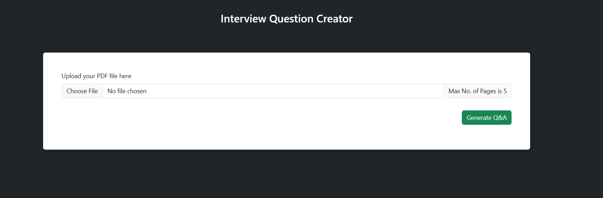

# Question-Answer-Creation-Chatbot

# 

A professional chatbot designed to assist in generating question-answer pairs, powered by advanced AI and various tools to enhance interaction and knowledge retrieval.


## Overview
This chatbot leverages powerful language models and tools to provide real-time question-answer creation. It utilizes the OpenAI API, LangChain, and other libraries to generate, refine, and display responses. It supports PDF parsing, natural language processing, and integrates with FastAPI to provide an efficient web interface.

## Features
- Generate question-answer pairs from text input
- Parse and extract information from PDF documents
- Interactive, user-friendly chatbot interface
- Customizable to fit different use cases
- Powered by OpenAI's GPT models
- Easily deployable as a web service with FastAPI

## Technologies Used
- LangChain: For natural language understanding and chaining different components.
- OpenAI: For utilizing GPT models to generate question-answer pairs.
- FastAPI: To deploy the chatbot as a web service.
- PyPDF2, pypdf: For parsing and extracting text from PDF documents.
- FAISS: For efficient similarity search and vector indexing.
- Uvicorn: To run the FastAPI server.
- Python-dotenv: For environment variable management.
- Tiktoken: For tokenization.


## Setup Instructions

### 1. Clone the repository

```bash
git clone <your-repository-url>
cd <your-project-folder>
```

### 2. Create a virtual environment
```bash
python -m venv venv
```

### 3. Activate the virtual environment
Windows:
```
.\venv\Scripts\activate
```

### 4. Install dependencies
Ensure that your requirements.txt is in the root directory of your project, then run:
```bash
pip install -r requirements.txt
```

### 5. Set up environment variables
```bash
OPENAI_API_KEY=your-openai-api-key
```


## Contributing

Contributions are welcome! If you have ideas to improve this repository or want to add more projects, please feel free to:

1. Fork the repository.
2. Make your changes.
3. Submit a pull request.

---

## License
This repository is licensed under the MIT License. Feel free to use and modify the code as needed.

---

## Author
**Md. Rasel Sarker**  
Email: [rasel.sarker6933@gmail.com](mailto:rasel.sarker6933@gmail.com)  

<br>
<h1 align="left">
 <h2> 🌐 Connect with Me:</h2>
</h1>

<p align="center">
  <a href="mailto:rasel.sarker6933@gmail.com"></a>
  <a href="https://github.com/raselsarker69"></a>
  <a href="https://www.linkedin.com/in/rasel-sarker-405160227/"></a>
  <a href="https://www.facebook.com/mdrasel.sarker.7773631"></a>
  <a href="https://www.kaggle.com/mdraselsarker"></a>
  <a href="https://www.youtube.com/@raselsarker69"></a>
  <a href="https://www.facebook.com/groups/832585175685301"></a>
  <br>
  
</p>
 

---

<div align="center">

Thank you for visiting my repository. I hope these projects inspire and guide your learning journey!

---

Feel free to explore, learn, and build upon these projects. Happy coding!<br>

&copy; 2025 Question Answering Chatbot.

</div>


